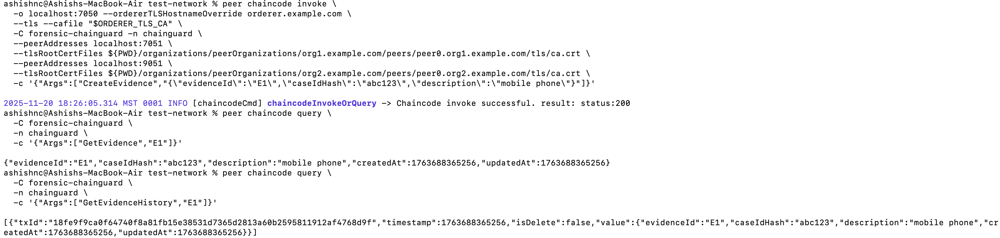

# Forensic Chainguard
### A Blockchain-Based Chain of Custody System for Digital Forensics

---

## ⭐ Overview

**Forensic Chainguard** is a complete chain-of-custody management platform built on **Hyperledger Fabric**. It is a blockchain-powered system designed to securely manage the lifecycle of forensic evidence — from collection to transfer, analysis, and final storage.  
Traditional chain-of-custody processes rely heavily on manual records and centralized databases, which can be vulnerable to tampering or human error.

This project uses **Hyperledger Fabric** to ensure that every interaction with an evidence item is **immutable, auditable, and cryptographically verifiable**. 

Each action (check-in, transfer, or removal) is recorded on the blockchain through a smart contract, providing full traceability and integrity.

---

## Current Project Status

### ✅ Implemented
- Fabric test network setup with custom channel **(`forensic-chainguard`)**
- Chaincode **(`chainguard`)** deployed — Version **1.0**, Sequence **1**
- Successful invoke and query transactions:
  - `CreateEvidence`
  - `GetEvidence`
  - `GetEvidenceHistory`
- Full implementation of evidence lifecycle transactions
- Role-based access enforcement
- Image hashing and tampering detection

---

## Contract and Stakeholder Interactions

### Implemented Interactions
- Evidence creation, retrieval, and audit history retrieval.

### Stakeholders

| **Role** | **Access / Responsibilities** |
|-----------|--------------------------------|
| **Forensic Technician** | Creates evidence and can check-in evidence|
| **Evidence Manager** | Checks-in/Transfer/Remove evidence |
| **Viewer** | Read-only access |
  
---

## High-level Code Walkthrough

- **`chainguard.contract.ts`** — defines transaction functions and logic placeholders  
- **`index.ts`** — registers the contract with Fabric runtime  
- **`tsconfig.json`** — compiles TypeScript to CommonJS under `chaincode/dist/`

> The next version will extend these to include validation and event emission.

---

## Dependencies & Setup Instructions

### Prerequisites
- **Node.js** v16 or higher  
- **npm** (or **yarn**)  
- **Hyperledger Fabric 2.x** development environment (e.g., Fabric test network)  

### Steps

1.  **Clone this repository**
    ```bash
    git clone https://github.com/harshithananjyala/cse540-forensic-chainguard.git
    cd cse540-forensic-chainguard
    ```

2.  **Install dependencies**
    ```bash
    npm install
    ```

3.  **Build TypeScript code**
    ```bash
    npm run build
    ```
Run the following commands from the fabric-network-setup/test-network folder

4. **Bring up the blockchain network**
    ```bash
    ./network.sh up createChannel -c forensic-chainguard
    ```

    > **About the Blockchain Network**
    > - **2 Organizations (Org1 & Org2)** — each with one peer node  
    > - **1 Ordering Service Node** — ensures transaction ordering and block creation  
    > - **1 Channel (`forensic-chainguard`)** — dedicated ledger for evidence records   
    >
    > The command initializes the network, creates the channel, and joins both organizations’ peers to it.  
    > This forms the base infrastructure for deploying and invoking the **Forensic Chainguard** smart contract.

5. **Deploy the chaincode on the channel**
    ```bash
    ./network.sh deployCC \
          -c forensic-chainguard \
          -ccn chainguard \
          -ccp <ABSOLUTE_PATH_TO_REPO>/chaincode \
          -ccl javascript \
          -ccv 1.0 \
          -ccs 1
    ```

6. **Set Org1 environment variables**
    ```bash
    export CORE_PEER_LOCALMSPID=Org1MSP
    export CORE_PEER_MSPCONFIGPATH=${PWD}/organizations/peerOrganizations/org1.example.com/users/Admin@org1.example.com/msp
    export CORE_PEER_ADDRESS=localhost:7051
    export CORE_PEER_TLS_ROOTCERT_FILE=${PWD}/organizations/peerOrganizations/org1.example.com/peers/peer0.org1.example.com/tls/ca.crt
    export ORDERER_TLS_CA=${PWD}/organizations/ordererOrganizations/example.com/tlsca/tlsca.example.com-cert.pem
    export CORE_PEER_TLS_ENABLED=true
    ```

7. **Invoke a transaction**
    ```bash
    peer chaincode invoke \
        -o localhost:7050 --ordererTLSHostnameOverride orderer.example.com \
        --tls --cafile "$ORDERER_TLS_CA" \
        -C forensic-chainguard -n chainguard \
        --peerAddresses localhost:7051 \
        --tlsRootCertFiles ${PWD}/organizations/peerOrganizations/org1.example.com/peers/peer0.org1.example.com/tls/ca.crt \
        --peerAddresses localhost:9051 \
        --tlsRootCertFiles ${PWD}/organizations/peerOrganizations/org2.example.com/peers/peer0.org2.example.com/tls/ca.crt \
        -c '{"Args":["CreateEvidence","{\"evidenceId\":\"E1\",\"caseIdHash\":\"abc123\",\"description\":\"mobile phone\"}"]}'
    ```

8. **Query evidence**
    ```bash
    peer chaincode query -C forensic-chainguard -n chainguard -c '{"Args":["GetEvidence","E1"]}'
    ```

9. **Query evidence history**
    ```bash
    peer chaincode query -C forensic-chainguard -n chainguard -c '{"Args":["GetEvidenceHistory","E1"]}'
    ```
    



10. **Backend setup**
    ```bash
    cd backend/
    npm start
    ```

11. **Bring down the network**
    ```bash
    ./network.sh down
    ```

---

## Authors / Contributors
- **Kruthi Tirunagari** — Blockchain & Security Specialist  
- **Ashish Nadadur Chakravarthi** — Blockchain & Smart Contract Developer  
- **Shashank Gadipally** — System Admin  
- **Sree Sai Harshitha Nanjyala** — Frontend & Smart Contract Developer  
- **Sri Sai Chetana Reddy Janagan** — Testing & Validation  

---

## License
This project is released under the **Apache-2.0 License**.

---

## Summary
**Forensic Chainguard** lays the groundwork for a trustworthy, tamper-proof evidence management system that combines cryptographic security with the transparency of blockchain.  

This milestone demonstrates a working Hyperledger Fabric setup with initial invoke/query functionality and sets the stage for the next iteration — full lifecycle management with role-based security and audit trails.